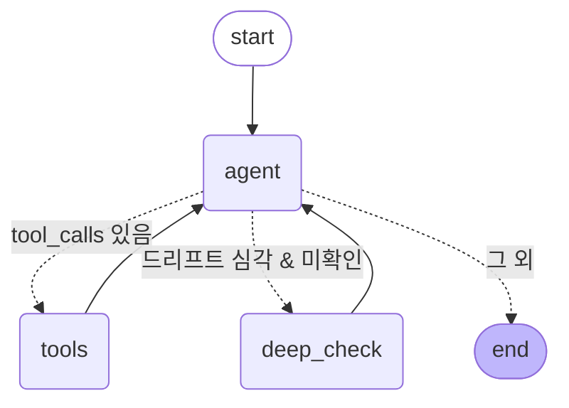

# 에이전트 그래프 (LangGraph StateGraph)

PdM 운영 어시스턴트는 `create_react_agent` 같은 prebuilt 대신 **StateGraph를 직접
구성**한다. 단순 ReAct 루프(agent↔tools)에 더해, 데이터 드리프트가 심각할 때
최종 답변 전에 추가 진단을 거치는 **조건부 분기(`deep_check`)**를 둔다.

> 위 그래프는 `python -m pdm.agent.agent --graph`(`graph.get_graph().draw_mermaid()`)
> 출력과 동일하다.

## 노드

- **agent** — 도구 4개가 바인딩된 `ChatOpenAI(gpt-5.4-mini)` 호출. tool_calls가
  담긴 AI 메시지를 반환한다.
- **tools** — prebuilt `ToolNode`. tool_calls를 실행하고 `ToolMessage`로 결과를 돌려준다.
  (그래프 자체는 직접 구성하므로 ToolNode만 재사용.)
- **deep_check** — 조건부 분기 노드. `check_drift` 결과 드리프트된 feature가 전체의
  절반 이상이면, 최종 답변 직전에 `get_recent_predictions`로 "예측 포화" 여부를
  진단해 컨텍스트에 주입하고 agent로 되돌린다. ("드리프트 심각 → 더 파본다")

## 엣지

- `START → agent`
- `agent →` (조건부) `tools` | `deep_check` | `END`
  - 마지막 AI 메시지에 tool_calls가 있으면 `tools`
  - 없고(=답하려 함) 드리프트가 심각한데 아직 심층진단을 안 했으면 `deep_check`
  - 그 외 `END`
- `tools → agent`, `deep_check → agent`

`deep_check`는 `deep_check_done` 가드로 한 번만 탄다(무한 루프 방지).
